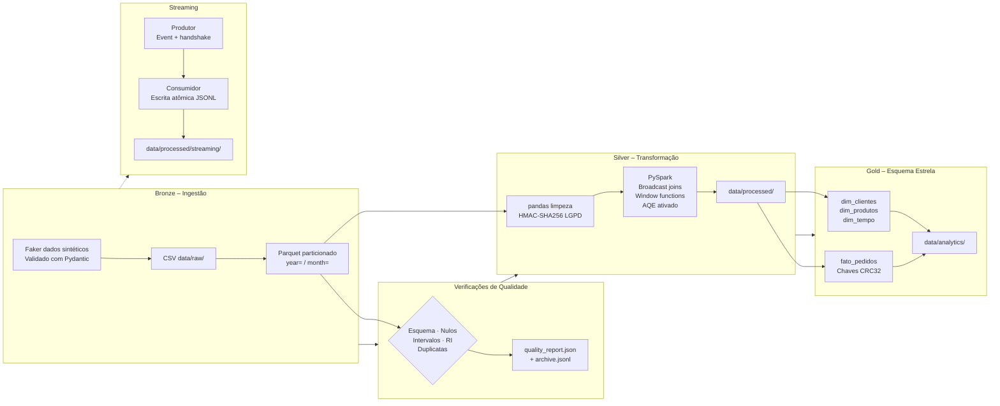

# Pipeline de Dados — Arquitetura Medallion

Pipeline de engenharia de dados end-to-end para dados sintéticos de e-commerce. Implementa a **Arquitetura Medallion** (Bronze → Silver → Gold), modelagem dimensional, validação de qualidade, anonimização compatível com LGPD e simulação de streaming com Kafka.


---

## Sobre o Projeto

Este projeto foi desenvolvido como portfólio de engenharia de dados, cobrindo as principais etapas de um pipeline real de produção:

- **Ingestão** de dados sintéticos com geração reprodutível via Faker (locale pt_BR)
- **Qualidade de dados** com 5 tipos de verificação e relatórios em JSON
- **Transformação** em dois passes: limpeza com pandas + enriquecimento com PySpark
- **Data Warehouse** com esquema estrela e chaves substitutas determinísticas (CRC32)
- **Streaming** simulado com lógica de produtor/consumidor via filas em memória ou Kafka real
- **Conformidade com LGPD** via pseudonimização HMAC-SHA256 em todos os campos PII

---

## Arquitetura



---

## Tecnologias

| Categoria | Tecnologias |
|---|---|
| Processamento de dados | pandas 2.1+, PySpark 3.5+ |
| Contratos de dados | Pydantic v2 |
| Geração de dados | Faker (pt_BR) |
| Streaming | kafka-python + simulação com fila em memória |
| Armazenamento | Parquet (particionado Hive), CSV, JSONL |
| SQL | PostgreSQL DDL + HiveQL |
| Testes | pytest, Hypothesis (testes baseados em propriedades) |
| Configuração | Pydantic-Settings + python-dotenv |
| Logging | python-json-logger (JSON estruturado) |
| Qualidade de código | ruff (linting + formatação) |

---

## Pré-requisitos

| Dependência | Versão | Observação |
|---|---|---|
| Python | 3.11+ | |
| Java JDK | 11+ | Necessário para o PySpark |
| Git | qualquer | |

---

## Instalação

```bash
git clone https://github.com/jmello04/data-pipeline-project.git
cd data-pipeline-project

python -m venv .venv
source .venv/bin/activate        # Linux / macOS
.venv\Scripts\activate           # Windows

pip install -r requirements.txt
```

---

## Configuração

```bash
cp .env.example .env
```

**Obrigatório:** defina `LGPD_HASH_KEY` antes de executar qualquer coisa.

```bash
# Gera uma chave segura (execute uma vez e cole no .env)
python -c "import secrets; print(secrets.token_hex(32))"
```

As demais variáveis possuem valores padrão funcionais.

| Variável | Padrão | Descrição |
|---|---|---|
| `LGPD_HASH_KEY` | *(obrigatório)* | Segredo ≥ 32 chars para anonimização HMAC-SHA256 |
| `NUM_CUSTOMERS` | `1000` | Quantidade de clientes sintéticos |
| `NUM_PRODUCTS` | `200` | Quantidade de produtos sintéticos |
| `NUM_ORDERS` | `5000` | Quantidade de pedidos sintéticos |
| `FAKE_DATA_SEED` | `42` | Semente para reprodutibilidade dos dados |
| `NULL_THRESHOLD` | `0.10` | Fração máxima de nulos por coluna antes de falhar |
| `USE_REAL_KAFKA` | `false` | Conectar a um broker Kafka real |
| `KAFKA_BOOTSTRAP_SERVERS` | `localhost:9092` | Endereço do broker Kafka |
| `STREAMING_INTERVAL_SEC` | `0.1` | Intervalo em segundos entre eventos produzidos |
| `STREAMING_NUM_EVENTS` | `50` | Total de eventos produzidos na simulação |
| `SPARK_MASTER` | `local[*]` | Master do Spark (local ou cluster) |

---

## Executando o Pipeline

```bash
python pipeline/run_all.py
# ou
make run
```

Os estágios executam em ordem de dependência:

| Estágio | Entrada | Saída |
|---|---|---|
| `bronze_ingestion` | — | `data/raw/*.csv` + Parquet particionado |
| `quality_checks` | `data/raw/` | `quality_report.json` + arquivo histórico |
| `silver_transformation` | `data/raw/` | `data/processed/cleaned/` + enriquecimentos Spark |
| `gold_warehouse` | `data/processed/cleaned/` | `data/analytics/` esquema estrela |
| `streaming_simulation` | — | `data/processed/streaming/*.jsonl` |

Estágios individuais também podem ser executados diretamente:

```bash
python pipeline/ingestion/ingest.py
python pipeline/quality/quality_checks.py
python pipeline/transformation/transform.py
python pipeline/warehouse/dw_model.py
python pipeline/streaming/kafka_simulation.py
```

---

## Executando os Testes

```bash
pytest tests/ -v
# ou
make test
```

A suíte inclui:
- **Testes unitários** cobrindo todas as funções de verificação, limpeza e construção do warehouse.
- **Testes baseados em propriedades** (Hypothesis) que verificam invariantes com milhares de entradas aleatórias.
- **Testes de regressão** para bugs específicos, como o bug de fatiamento de ano/mês em `build_fato_pedidos`.

| Arquivo de teste | O que cobre |
|---|---|
| `tests/test_quality.py` | `_anonymise`, todas as funções `check_*`, todas as funções `clean_*`, consistência de hash em FKs |
| `tests/test_warehouse.py` | `_crc32_sk`, todos os construtores de dimensão, grão e corretude de ano/mês em `build_fato_pedidos` |

---

## Camadas de Dados

### Bronze — Ingestão

O Faker gera 6 datasets (clientes, produtos, pedidos, itens de pedido, pagamentos, avaliações). Cada linha é validada contra um schema Pydantic antes de ser gravada. Valores monetários são calculados em centavos inteiros para evitar imprecisão de ponto flutuante. Saída: CSV + Parquet particionado no padrão Hive (`year=AAAA/month=MM`).

### Silver — Transformação

Dois passes de processamento:

1. **pandas** — deduplicação, coerção de tipos, anonimização LGPD.
2. **PySpark** — broadcast joins (tabelas dimensão), window functions (`RANK`, `LAG`, totais acumulados), execução adaptativa de queries (AQE).

**LGPD:** As colunas PII (`customer_id`, `name`, `email`) são substituídas por digests HMAC-SHA256 com chave `LGPD_HASH_KEY`. O mesmo valor bruto sempre produz o mesmo digest, preservando os relacionamentos de chave estrangeira após a anonimização.

### Gold — Esquema Estrela

| Tabela | Grão | Observações |
|---|---|---|
| `dim_clientes` | uma linha por cliente | NKs anonimizados |
| `dim_produtos` | uma linha por produto | margem calculada com segurança (preço = 0 → 0%) |
| `dim_tempo` | uma linha por dia do calendário | conjunto completo de atributos |
| `fato_pedidos` | uma linha por item de pedido | particionado por ano/mês |

Chaves substitutas geradas com **CRC32 determinístico** sobre a chave natural — estáveis entre execuções, sem dependência de ordem de sort, seguras para cargas incrementais e upserts.

---

## Queries Analíticas

O diretório `sql/` contém queries prontas para consumo analítico:

| Query | Descrição |
|---|---|
| Q1 | Receita mensal por categoria (pedidos entregues) |
| Q2 | Top 20 produtos mais vendidos por unidades e receita |
| Q3 | Ticket médio por canal e método de pagamento (últimos 12 meses) |
| Q4 | Indicador de churn — dias desde o último pedido por cliente |
| Q5 | Análise de coorte — rastreamento por mês da primeira compra |

Versões PostgreSQL em `sql/queries_analytics.sql` e equivalentes HiveQL/Spark SQL em `sql/hql_queries.hql`.

---

## Registros de Decisão Arquitetural (ADRs)

### ADR-001: HMAC-SHA256 em vez de SHA-256 simples para LGPD

`SHA-256("alice@example.com")` é estático e pode ser consultado em tabelas pré-computadas (rainbow tables). `HMAC-SHA256("alice@example.com", key=segredo)` não pode ser pré-computado sem a chave, satisfazendo a pseudonimização exigida pelo Art. 12 da LGPD. A mesma chave é usada em todas as tabelas para que os joins por FK sobrevivam à anonimização.

### ADR-002: Chaves substitutas CRC32 em vez de inteiros sequenciais

`range(1, n+1)` atribui inteiros diferentes à mesma entidade de negócio se a ordem do DataFrame mudar entre execuções. `CRC32(chave_natural)` é determinístico e estável — reexecutar a camada Gold produz as mesmas PKs, tornando cargas incrementais e upserts seguros.

### ADR-003: Schemas Spark StructType explícitos, sem inferência

A inferência de schema escaneia o dataset inteiro antes da execução e frequentemente infere combinações incorretas de nullable/tipo para colunas datetime e opcionais. Definições StructType explícitas eliminam o overhead de scan e tornam os contratos de schema explícitos no código.

### ADR-004: Threading Event handshake na simulação de streaming

Sem um sinal de prontidão, o produtor pode esvaziar a fila antes que o consumidor inicie, causando timeout e escrita de lote vazio. Um `threading.Event` garante que o produtor não emita eventos até o consumidor sinalizar que está ouvindo.

### ADR-005: Escrita atômica de JSONL

Gravar registros incrementalmente no arquivo alvo deixa um arquivo parcialmente escrito e inválido se o processo falhar no meio da escrita. Gravar em arquivo temporário no mesmo diretório e renomear atomicamente garante que o arquivo anterior sempre permanece íntegro em caso de falha.

---

## Estrutura do Projeto

```
data-pipeline-project/
├── config/
│   └── settings.py              # Pydantic BaseSettings — configuração validada e type-safe
├── data/                        # .gitignore — apenas local
│   ├── raw/                     # Bronze: CSV + Parquet particionado
│   ├── processed/               # Silver: limpo + enriquecimentos Spark + relatório de qualidade
│   └── analytics/               # Gold: esquema estrela em Parquet
├── logs/                        # .gitignore — apenas local (logs JSON estruturados)
├── notebooks/
│   └── exploratory_analysis.ipynb
├── pipeline/
│   ├── ingestion/ingest.py      # Bronze: geração Faker → Parquet
│   ├── transformation/
│   │   └── transform.py         # Silver: limpeza pandas + enriquecimento PySpark
│   ├── quality/
│   │   └── quality_checks.py    # 5 tipos de verificação + relatório JSON + histórico
│   ├── warehouse/
│   │   └── dw_model.py          # Gold: esquema estrela com chaves CRC32
│   ├── streaming/
│   │   └── kafka_simulation.py  # Produtor/consumidor com Event handshake
│   ├── schemas/
│   │   └── models.py            # Contratos Pydantic para cada dataset
│   ├── utils/
│   │   ├── decorators.py        # @retry (backoff exponencial), @timed
│   │   └── logging_config.py    # Logger JSON em arquivo + texto simples no stdout
│   └── run_all.py               # Orquestrador com dependências entre estágios
├── sql/
│   ├── create_tables.sql        # DDL com constraints, índices e comentários
│   ├── queries_analytics.sql    # 5 queries analíticas (PostgreSQL)
│   └── hql_queries.hql          # Equivalentes em HiveQL/Spark SQL
├── tests/
│   ├── conftest.py              # Fixtures de sessão com IDs pré-hasheados via HMAC
│   ├── test_quality.py          # Verificações de qualidade + testes unitários/propriedades
│   └── test_warehouse.py        # Modelo dimensional + testes unitários/propriedades + regressões
├── Makefile                     # Atalhos: install, run, test, clean
├── pyproject.toml               # Metadados do projeto, configuração pytest e ruff
├── .python-version              # Fixa Python 3.11
├── .env.example                 # Template de configuração
├── .gitignore
└── requirements.txt
```

---

## Makefile

```bash
make install   # Cria virtualenv e instala dependências
make run       # Executa o pipeline completo
make test      # Roda a suíte de testes com pytest
make clean     # Remove __pycache__, .pytest_cache, .mypy_cache
```

---

## Licença

MIT — veja [LICENSE](LICENSE) para detalhes.
