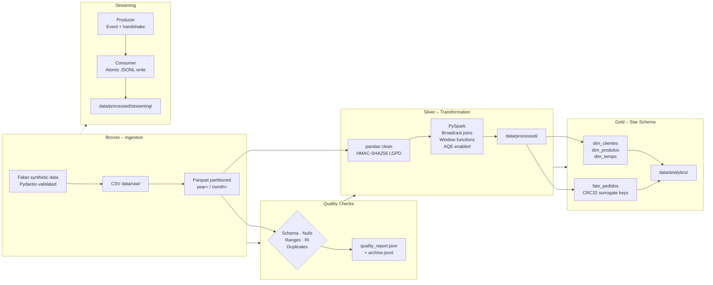

# data-pipeline-project

End-to-end data engineering pipeline for synthetic e-commerce data.  Implements the Medallion architecture (Bronze → Silver → Gold), dimensional modelling, data quality validation, LGPD-compliant anonymisation, and Kafka streaming simulation.


---

## Architecture



---

## Prerequisites

| Dependency | Version | Notes |
|---|---|---|
| Python | 3.11+ | |
| Java JDK | 11+ | Required by PySpark |
| Git | any | |

---

## Installation

```bash
git clone https://github.com/jmello04/data-pipeline-project.git
cd data-pipeline-project

python -m venv .venv
source .venv/bin/activate        # Linux / macOS
.venv\Scripts\activate           # Windows

pip install -r requirements.txt
```

---

## Configuration

```bash
cp .env.example .env
```

**Required:** set `LGPD_HASH_KEY` before running anything.

```bash
# Generate a secure key (run once, paste into .env)
python -c "import secrets; print(secrets.token_hex(32))"
```

All other variables have working defaults.

| Variable | Default | Description |
|---|---|---|
| `LGPD_HASH_KEY` | *(required)* | ≥ 32-char secret for HMAC-SHA256 anonymisation |
| `NUM_ORDERS` | `5000` | Synthetic orders to generate |
| `NULL_THRESHOLD` | `0.10` | Max null fraction per column before quality check fails |
| `USE_REAL_KAFKA` | `false` | Connect to a live Kafka broker |
| `STREAMING_INTERVAL_SEC` | `0.1` | Seconds between produced events |

---

## Running the pipeline

```bash
python pipeline/run_all.py
# or
make run
```

Stages execute in dependency order:

| Stage | Input | Output |
|---|---|---|
| `bronze_ingestion` | — | `data/raw/*.csv` + partitioned Parquet |
| `quality_checks` | `data/raw/` | `quality_report.json` + archive |
| `silver_transformation` | `data/raw/` | `data/processed/cleaned/` + Spark enrichments |
| `gold_warehouse` | `data/processed/cleaned/` | `data/analytics/` star schema |
| `streaming_simulation` | — | `data/processed/streaming/*.jsonl` |

Individual stages can be run directly:

```bash
python pipeline/ingestion/ingest.py
python pipeline/quality/quality_checks.py
python pipeline/transformation/transform.py
python pipeline/warehouse/dw_model.py
python pipeline/streaming/kafka_simulation.py
```

---

## Running tests

```bash
pytest tests/ -v
# or
make test
```

The suite includes property-based tests (Hypothesis) that verify invariants across thousands of random inputs — not just the three rows in a fixture.

---

## Data layers

### Bronze
Faker generates 6 datasets (customers, products, orders, order\_items, payments, reviews).  Each row is validated against a Pydantic schema before being written.  Monetary values are computed in integer cents then divided to avoid float drift.  Output: CSV + Hive-partitioned Parquet (`year=YYYY/month=MM`).

### Silver
Two passes:
1. **pandas** — dedup, type coercion, LGPD anonymisation.
2. **PySpark** — broadcast joins (dimension tables), window functions (`RANK`, `LAG`, running totals), adaptive query execution.

**LGPD**: PII columns (`customer_id`, `name`, `email`) are replaced with HMAC-SHA256 digests keyed by `LGPD_HASH_KEY`.  The same raw value always produces the same digest, so foreign-key relationships survive anonymisation.

### Gold
Star schema with deterministic CRC32 surrogate keys.

| Table | Grain | Notes |
|---|---|---|
| `dim_clientes` | one row per customer | anonymised NKs |
| `dim_produtos` | one row per product | margin computed safely (price = 0 → 0%) |
| `dim_tempo` | one row per calendar day | full attribute set |
| `fato_pedidos` | one row per order-item | partitioned by year/month |

---

## Architecture Decision Records

### ADR-001: HMAC-SHA256 over plain SHA-256 for LGPD

Plain `SHA-256("alice@example.com")` is static and can be looked up in pre-computed tables.  `HMAC-SHA256("alice@example.com", key=secret)` cannot be pre-computed without the key, satisfying pseudonymisation under LGPD Art. 12.  The same key is used across all tables so FK joins survive anonymisation.

### ADR-002: CRC32 surrogate keys instead of sequential integers

`range(1, n+1)` assigns different integers to the same business entity if the source DataFrame sort order changes between pipeline runs.  CRC32(natural\_key) is deterministic and stable — re-running the Gold layer produces identical PKs, making incremental loads and upserts safe.

### ADR-003: Explicit Spark StructType schemas, no inference

Schema inference scans the entire dataset before execution and frequently infers wrong nullable/type combinations for datetime and optional columns.  Explicit StructType definitions eliminate the scan overhead and make schema contracts explicit in code.

### ADR-004: Threading Event handshake in streaming simulation

Without a ready signal the producer can drain the queue before the consumer starts, causing the consumer to time out and write an empty batch.  A `threading.Event` ensures the producer does not emit until the consumer signals it is listening.

### ADR-005: Atomic JSONL writes

Writing records incrementally to the target file leaves a partially-written, invalid file if the process crashes mid-write.  Writing to a temp file in the same directory and renaming atomically ensures the previous file is always intact on failure.

---

## Project structure

```
data-pipeline-project/
├── config/
│   └── settings.py              # Pydantic BaseSettings — validated, type-safe
├── data/                        # .gitignore — local only
│   ├── raw/                     # Bronze: CSV + partitioned Parquet
│   ├── processed/               # Silver: cleaned + spark enrichments + quality report
│   └── analytics/               # Gold: star schema Parquet
├── logs/                        # .gitignore — local only (JSON structured logs)
├── notebooks/
│   └── exploratory_analysis.ipynb
├── pipeline/
│   ├── ingestion/ingest.py      # Bronze: Faker generation → Parquet
│   ├── transformation/
│   │   └── transform.py         # Silver: pandas clean + PySpark enrichment
│   ├── quality/
│   │   └── quality_checks.py    # 5 check types + JSON report + archive
│   ├── warehouse/
│   │   └── dw_model.py          # Gold: star schema with CRC32 SKs
│   ├── streaming/
│   │   └── kafka_simulation.py  # Producer/consumer with Event handshake
│   ├── schemas/
│   │   └── models.py            # Pydantic data contracts for each dataset
│   ├── utils/
│   │   ├── decorators.py        # @retry (exponential backoff), @timed
│   │   └── logging_config.py    # JSON file + plain stdout logger
│   └── run_all.py               # Orchestrator with stage dependencies
├── sql/
│   ├── create_tables.sql        # DDL with constraints, indexes, comments
│   ├── queries_analytics.sql    # 5 analytical queries
│   └── hql_queries.hql          # HiveQL equivalents
├── tests/
│   ├── conftest.py              # Session-scoped fixtures with HMAC-hashed IDs
│   └── test_quality.py          # Unit + property-based (Hypothesis) tests
├── Makefile
├── .env.example
├── .gitignore
└── requirements.txt
```
