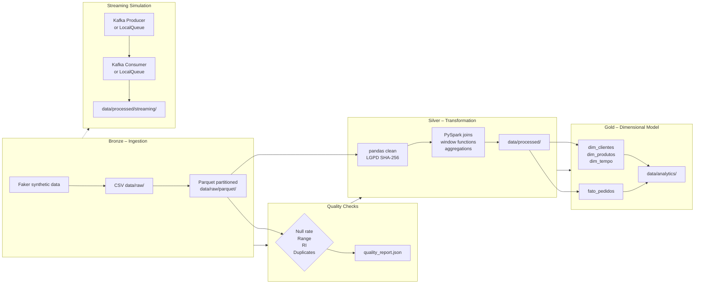

# data-pipeline-project

End-to-end data engineering pipeline for synthetic e-commerce data, implementing the Medallion architecture (Bronze → Silver → Gold), dimensional modelling, data quality validation, and streaming simulation.


---

## Architecture



---

## Prerequisites

| Tool | Version |
|---|---|
| Python | 3.11+ |
| Java | 11+ (required by PySpark) |
| Git | any |

---

## Installation

```bash
# 1. Clone
git clone https://github.com/<your-username>/data-pipeline-project.git
cd data-pipeline-project

# 2. Create and activate virtual environment
python -m venv .venv
source .venv/bin/activate        # Linux/macOS
.venv\Scripts\activate           # Windows

# 3. Install dependencies
pip install -r requirements.txt
```

---

## Configuration

```bash
# Copy the example env file and fill in any values you want to override
cp .env.example .env
```

All pipeline behaviour is controlled through `.env`.  The defaults work out of the box — no mandatory changes required to run the pipeline.

Key variables:

| Variable | Default | Description |
|---|---|---|
| `NUM_ORDERS` | `5000` | Number of synthetic orders to generate |
| `NULL_THRESHOLD` | `0.10` | Max acceptable null fraction per column |
| `USE_REAL_KAFKA` | `false` | Set `true` to connect to a live Kafka broker |
| `KAFKA_BOOTSTRAP_SERVERS` | `localhost:9092` | Kafka broker address (only if above is `true`) |

---

## Running the pipeline

```bash
python pipeline/run_all.py
```

This executes all stages in sequence with structured logging to both stdout and `logs/pipeline.log`:

1. **Bronze** — generates synthetic data, saves CSV + Parquet
2. **Quality checks** — validates nulls, ranges, RI, duplicates → `data/processed/quality_report.json`
3. **Silver** — pandas cleaning + LGPD anonymisation + PySpark enrichment
4. **Gold** — builds star schema dimensions and fact table
5. **Streaming** — runs producer/consumer simulation

Individual stages can also be run directly:

```bash
python pipeline/ingestion/ingest.py
python pipeline/quality/quality_checks.py
python pipeline/transformation/transform.py
python pipeline/warehouse/dw_model.py
python pipeline/streaming/kafka_simulation.py
```

---

## Running tests

```bash
pytest tests/ -v
```

Tests cover: SHA-256 LGPD hashing, null-rate checks, numeric range validation, referential integrity checks, duplicate detection, and cleaning functions.

---

## Data layers

### Bronze
Raw synthetic data generated with Faker.  Persisted as CSV and then as Hive-partitioned Parquet (`year=<y>/month=<m>`).  Only ingestion metadata is logged (row counts, column counts, null percentages).

### Silver
Cleaned and anonymised data.  PII columns (`customer_id`, `name`, `email`) are irreversibly hashed with SHA-256 (LGPD compliance).  PySpark is used for cross-table joins, window functions (`RANK`, `LAG`, running totals), and category-level aggregations.

### Gold
Star schema:
- **`dim_clientes`** — anonymised customer attributes with surrogate key `sk_cliente`
- **`dim_produtos`** — product catalogue with margin derived field
- **`dim_tempo`** — fully-populated date dimension (day granularity)
- **`fato_pedidos`** — order-item grain fact table, partitioned by `year`/`month`

---

## Project structure

```
data-pipeline-project/
├── config/
│   └── settings.py          # Central config loader — imports from .env
├── data/                    # Gitignored — local only
│   ├── raw/                 # Bronze: CSV + Parquet
│   ├── processed/           # Silver: cleaned Parquet + quality report
│   └── analytics/           # Gold: dimensional model Parquet
├── logs/                    # Gitignored — local only
├── notebooks/
│   └── exploratory_analysis.ipynb
├── pipeline/
│   ├── ingestion/ingest.py
│   ├── transformation/transform.py
│   ├── quality/quality_checks.py
│   ├── warehouse/dw_model.py
│   ├── streaming/kafka_simulation.py
│   └── run_all.py           # Pipeline orchestrator
├── sql/
│   ├── create_tables.sql    # DDL with constraints and indexes
│   ├── queries_analytics.sql
│   └── hql_queries.hql
├── tests/
│   └── test_quality.py
├── .env.example
├── .gitignore
├── requirements.txt
└── README.md
```
